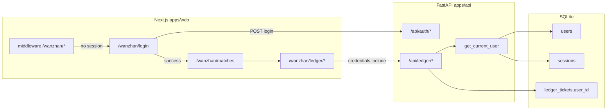

# 用户系统与记账本隔离 — 设计说明

**日期：** 2026-05-15  
**开发基线：** `.worktrees/football-calculator-mvp`（分支 `feature/football-calculator-mvp`）  
**状态：** 待实现（用户已确认设计）

---

## 1. 目标

- 用户信息持久化到 SQLite。
- **未登录不能进入万站**（`/wanzhan/*`）；登录后默认进入 **赛程赛果**（`/wanzhan/matches`）。
- **记账本**（`/api/ledger/*`）按 `user_id` 隔离；其他 API（OCR 票据、赛程）本版仍匿名。
- 不开放自助注册；通过 **CLI** 手工创建用户；初始密码在命令行传入。

---

## 2. 非目标（本版不做）

- 自助注册、找回密码、第三方登录
- 旧 `ledger_tickets` / `localStorage` 数据迁移（上线后账本从空开始）
- OCR `tickets` 表按用户隔离
- 管理员 Web 后台

---

## 3. 已确认的产品决策

| 项 | 决策 |
|----|------|
| 建号 | CLI：`python -m app.tools.create_user --username … --password …` |
| 登录标识 | 用户名（建议存储时规范化：trim + 转小写；登录比对不区分大小写） |
| 会话 | HttpOnly Cookie，**30 天** |
| 会话实现 | **服务端 session 表** + 不透明 `fc_session` Cookie（方案 1） |
| 登录后落地页 | `/wanzhan/matches` |
| 保护范围 | 整个 `/wanzhan/*`（`/wanzhan/login` 除外） |
| 历史账本 | 不迁移；`ledger_tickets` 增加 `user_id` 后仅新数据 |

---

## 4. 架构



**推荐方案：** 服务端 session 表（非 JWT Cookie）。便于删号、改密后吊销会话；请求量小，每次查 session 可接受。

---

## 5. 数据模型

### 5.1 `users`

| 列 | 类型 | 说明 |
|----|------|------|
| `id` | TEXT PK | `uuid4().hex` |
| `username` | TEXT UNIQUE NOT NULL | 规范化后存储 |
| `password_hash` | TEXT NOT NULL | bcrypt |
| `created_at` | INTEGER NOT NULL | epoch 秒 |

### 5.2 `sessions`

| 列 | 类型 | 说明 |
|----|------|------|
| `id` | TEXT PK | 随机 token，写入 Cookie |
| `user_id` | TEXT NOT NULL | FK → `users.id` |
| `expires_at` | INTEGER NOT NULL | 登录时 `now + 30d` |
| `created_at` | INTEGER NOT NULL | |

索引：`idx_sessions_user_id (user_id)`。

### 5.3 `ledger_tickets` 变更

- 新增列：`user_id TEXT NOT NULL`
- 索引：`idx_ledger_tickets_user_date (user_id, date)`

`ledger_legs` 不变（通过 `ticket_id` 间接归属用户）。

### 5.4 迁移与旧数据

- **新库：** `migrate()` 直接创建带 `user_id` 的表结构。
- **已有库（无 `user_id` 列）：** 运维说明二选一（实现时选一种并写进迁移脚本注释）：
  1. **清空** `ledger_tickets` / `ledger_legs` 后 `ALTER TABLE` 加列；或
  2. 要求删除 SQLite 文件重建（与「从空账本开始」一致）。

不尝试把旧票归属到某用户。

---

## 6. API 契约

### 6.1 Auth

| 方法 | 路径 | Body | 成功 | 失败 |
|------|------|------|------|------|
| POST | `/api/auth/login` | `{ "username": string, "password": string }` | 200 `{ "id", "username" }` + `Set-Cookie` | 401 统一文案 |
| POST | `/api/auth/logout` | — | 204，清 Cookie、删 session | — |
| GET | `/api/auth/me` | — | 200 `{ "id", "username" }` | 401 |

**401 登录失败文案：** `用户名或密码错误`（不区分用户不存在与密码错误）。

### 6.2 Cookie

| 属性 | 值 |
|------|-----|
| 名称 | `fc_session` |
| HttpOnly | true |
| Path | `/` |
| SameSite | `Lax` |
| Max-Age | `2592000`（30 天） |
| Secure | 生产 HTTPS 启用 |

### 6.3 Ledger（变更）

所有 `/api/ledger/*` 路由依赖 `get_current_user()`：

- 创建、列表、汇总、单票查询、结算 — 仅当前 `user_id`。
- 未登录：**401**。

OCR `/api/tickets/*`、赛程 `/api/matches/*`：**不强制登录**（本版）。

### 6.4 `get_current_user` 行为

1. 读 Cookie `fc_session`；缺失 → 401。
2. 查 `sessions`；不存在或 `expires_at < now` → 删过期行（若有）→ 401。
3. 返回 `User`（`id`, `username`）。

---

## 7. CLI 建号

```bash
cd apps/api
uv run python -m app.tools.create_user --username alice --password '初始密码'
```

- 用户名已存在：退出码非 0，stderr 提示。
- 密码经 bcrypt 后写入；**不在日志中打印密码**。
- 文档提醒：避免密码进入 shell history（可用 `read -s` 或 env 文件，运维自行选择）。

---

## 8. 前端

### 8.1 页面

- **`/wanzhan/login`**：用户名 + 密码；提交 `POST /api/auth/login`；成功 `router.replace("/wanzhan/matches")`。
- **`/wanzhan/me`**：展示 `username`；「退出」调用 `POST /api/auth/logout` 后跳转 login。

### 8.2 `api.ts`

- 所有 `fetch` 增加 `credentials: "include"`。
- 全局处理：非 login 页面收到 **401** → 跳转 `/wanzhan/login`（避免循环：login 请求失败仅展示错误）。

### 8.3 Next.js middleware

- 匹配：`/wanzhan/:path*`。
- **放行：** `/wanzhan/login`。
- **未登录：** 302 → `/wanzhan/login?next=<pathname>`（可选 `next`，登录成功后若存在则跳转，否则 `/wanzhan/matches`）。
- **已登录访问 login：** 302 → `/wanzhan/matches`。

**Session 检测（实现二选一，spec 推荐 A）：**

- **A（推荐）：** middleware 请求同源 `GET /api/auth/me`（需 dev 下 Next rewrite 或同源反代）。
- **B：** 仅检查 Cookie 是否存在（快但不验证过期；依赖 API 401 兜底）。

### 8.4 与现有路由

- 根路径 `/` 已 `redirect("/wanzhan/matches")`；middleware 会先要求登录。
- TabBar 第一项为赛程，与默认落地一致。

### 8.5 清理

- `wanzhanLedger.ts`（localStorage）若已无引用，实现阶段删除或标记废弃，避免与 API 账本双写。

---

## 9. 后端模块划分

| 模块 | 职责 |
|------|------|
| `app/domain/auth/models.py` | `User`, `LoginRequest` 等 |
| `app/domain/auth/passwords.py` | bcrypt hash/verify |
| `app/storage/user_store.py` | users CRUD |
| `app/storage/session_store.py` | sessions 创建/删除/按 id 查询 |
| `app/auth/deps.py` | `get_current_user` |
| `app/routes/auth.py` | login / logout / me |
| `app/tools/create_user.py` | CLI 入口 |
| `app/storage/ledger_store.py` | 所有 SQL 增加 `user_id` 条件 |
| `app/routes/ledger.py` | 注入 `current_user` |

`main.py`：注册 `auth` router；CORS 保持 `allow_credentials=True`，`allow_origins` 为明确前端 origin 列表（禁止 `*`）。

---

## 10. 安全

- 密码仅存 bcrypt hash。
- Session ID 使用密码学安全随机（`secrets.token_urlsafe` 等）。
- 登录失败不泄露用户是否存在。
- CSRF：同站部署 + `SameSite=Lax`；跨域分体部署时再评估 CSRF token（follow-up）。
- 登录限速：follow-up（非 MVP 阻塞项）。

---

## 11. 测试

| 场景 | 预期 |
|------|------|
| CLI 创建用户 | DB 有行，密码可验证 |
| 登录 | `Set-Cookie`，`/api/auth/me` 200 |
| 错误密码 | 401 |
| 用户 A 创建 ledger 票 | 用户 B `GET` 同 id → 404 或 403 |
| 未登录 `GET /api/ledger/tickets` | 401 |
| 登出 | Cookie 清除，后续 me 401 |
| 过期 session | me 401（可测短 TTL 或 mock 时间） |

---

## 12. 部署注意

- 生产：Next 与 API **同源**（Nginx `/api` → FastAPI）时 Cookie 与 middleware 最简单。
- 开发：`next.config.mjs` rewrite `/api` → `127.0.0.1:8000`，前端 `NEXT_PUBLIC_API_BASE_URL` 为空，保证 browser 对 `/api/auth/me` 为同源。
- CORS：若 dev 仍跨端口访问 API，需把前端 origin 列入 `allow_origins` 且 `allow_credentials=True`（worktree `main.py` 已开启 credentials）。

---

## 13. 实现顺序建议（供 writing-plans 使用）

1. DB 迁移 + `UserStore` / `SessionStore` + bcrypt
2. Auth 路由 + `get_current_user` + 测试
3. CLI `create_user`
4. `LedgerStore` 加 `user_id` + ledger 路由鉴权 + 测试
5. 前端 login、`credentials`、middleware、me 页退出
6. 文档：首次部署建第一个用户命令

---

## 14. 决策记录

| 决策 | 理由 |
|------|------|
| Session 表而非 JWT Cookie | 30 天内可吊销、改密可失效旧会话 |
| 仅 ledger 鉴权 | 用户明确记账本关联用户；赛程/OCR 后续可扩展 |
| 默认 `/wanzhan/matches` | 产品：先进赛程再看账本 |
| 不迁移旧数据 | 降低迁移风险，与空账本策略一致 |
